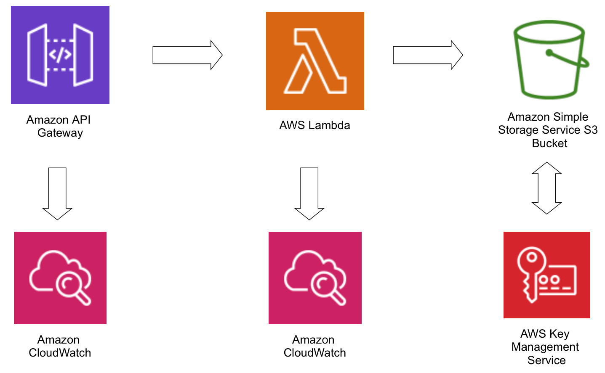

# Serverless AWS Project: Lambda + API Gateway

## 📌 Notes
- HTTP API Gateway chosen for cost efficiency (~70% cheaper than REST).  
- This project highlights real deployment pipelines and serverless architecture, while demonstrating awareness of monitoring, 
alerting, and advanced security best practices for production environments.
- Some IAM policies reference the root account because this project uses a personal AWS account. In production, replace 
these with dedicated roles or remove root access entirely to follow the principle of least privilege.
- When the repository was made public, all GitHub Actions IAM permissions were revoked to prevent unauthorized access to AWS.

This project demonstrates a secure, serverless application built on **AWS Lambda**, exposed via **API Gateway**, with **CI/CD pipelines** and 
infrastructure managed via **Terraform**. It’s a hands-on showcase of modern serverless architecture and deployment automation, including 
considerations for security, monitoring, and scalability.

## ✅ Implemented Features

### AWS Lambda & API Gateway
- Lambda function exposed via **HTTP API Gateway**.
- Supports:
  - **Lambda from Docker Image** (built and pushed to **ECR** via CI/CD pipeline).  
  - **Lambda from S3** (packaged zip uploaded via CI/CD pipeline, follow instructions in the comment to enable this as ECR code needs to be 
  commented and s3 code needs to be uncommented).  
- Basic API security:
  - HTTPS requests
  - IAM policy-based access control
- Functionality: Lists contents of an S3 bucket (demonstrates least-privilege IAM role).

### Infrastructure as Code
- **Terraform modules** for Lambda, API Gateway, ECR, S3, and KMS.
- Automated deployment pipelines via Terraform.
- Resource versioning and secure IAM permissions.

### CI/CD Pipelines (GitHub Actions)
- **PR Workflow:** Runs Python tests to validate code before merge.
- **Build & Deploy Workflow:**
  - Packages Lambda (Docker image or zip)
  - Uploads to S3 or ECR
  - Applies Terraform changes automatically
- **Checks:** Basic tests.

### Rollback Strategy
- Lambda functions are versioned using **semantic versioning** (e.g., 1.0.0, 1.0.1).  
- CI/CD pipelines (both ECR and S3) allow deploying any existing version by selecting it in the workflow.  
- If the version already exists, the pipeline reuses it; otherwise, it deploys a new one.  
- This enables straightforward rollback by simply selecting a previous stable version.

### Security & Permissions
- **KMS encryption** for sensitive S3 objects or in case somebody that shouldn't have access has permissions to delete s3 policy.
- **IAM least-privilege** roles for Lambda and CI/CD deployment.
- S3 bucket access restricted to (policy is present to prevent other teams accessing the bucket):
  - Lambda functions
  - GitHub Actions deployment role
- Lambda logs centralized in CloudWatch (structured logs).
- HTTPS enforced by default for Lambda and API Gateway.

### Monitoring
- Centralized logging and structured parsing in CloudWatch

## 💡 Considerations / Best Practices (Not Yet Implemented)

These features show awareness of production-grade architecture:

- **Monitoring & Metrics:**
  - Lambda: invocation count, duration, throttles, concurrent executions  
  - API Gateway: 4XX/5XX error rates, latency, request count  

- **Dashboarding & Alerting:**
  - Metrics visualization: Amazon Managed Grafana, Grafana Cloud or self hosted depending on team size and company goals
  - Logs analysis: OpenSearch (can be serverless)
  - Alerts: CloudWatch metric filters → CloudWatch alarms → SNS → Chatbot → Slack/Teams
  - Noise reduction: Time-averaged alerts to reduce false positives

- **Advanced Security / Hardening:**
  - GuardDuty for threat detection
  - AWS Advanced Shield for DDoS protection
  - API Gateway REST Options: Can be placed in a VPC and made private via VPC endpoints, WAF, API keys, throttling, caching, traces.
  - S3 versioning for Lambda code backups

- **CI/CD Pipelines** (GitHub Actions)
  - Apart of unit and end to end test it should also run Linting and integration tests.

## ⚡ How to Use / Test

1. Deploy **bootstrap Terraform stack** for GitHub Actions permissions, ECR / S3.
2. Push code to GitHub:
   - Triggers pipelines for Lambda deployment.  
3. Use `terraform-infrastructure/test.py` to call API Gateway:
   - Ensure your IAM role is added to the API Gateway policy to receive a `200 OK` response.
   - Ensure you put the URL of the API gateway

## 🛠 Technology Stack
- **AWS Services:** Lambda, API Gateway (HTTP), ECR, S3, KMS, IAM  
- **CI/CD:** GitHub Actions  
- **IaC:** Terraform  
- **Programming Language:** Python
